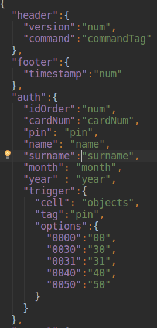
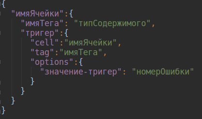
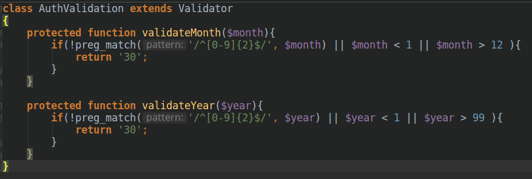
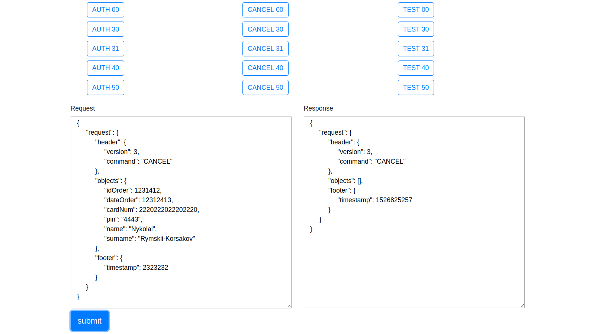

## Основные моменты
Основная идея была сделать максимально гибкую программу, где основные настройки ценртрализовано находились бы в одном месте.    
В файле parametrs.json  находится "пульт управления" программой  
  
Здесь описаны параметры протокола в виде  
  
Для того чтобы изменить настройки  пакета или добавить новый тип пакета не надо лезть в код(почти, см. "Добавление нового типа пакета").  
В программе существует классы-контейнеры, контейнеры потому что кроме уникальных для пакета методов они ничего не содержат.
  
### Добавление нового  типа пакета
Чтобы добавить новый тип пакета достаточно внести настройки в parametrs.json и добавить в app/controllers класс-контейнер с именем
Имяпакета+Validation например TestValidation(идеально было бы если класс создавался через терминал, но это на будущее),
если в пакете существует уникальный тип надо добавить функцию валидации с названием validate+ИмяТипа пример validateCardNum, которая возвращает код ошибки в случае неудачи
и ничего, если значение валидно.
## Сценарий и чек-лист
Сценарий и чек-лист находятся в папке texts
## Используемые технологии
+ ООП
+ MVC
+ AJAX
+ Jquery
+ Twig
+ Twitter Bootstrap
+ Composer Autoload
+ JSON
+ Git
## Установка
+ Установить  Апач и скопировать настройки в файле `httpd.conf`
+ Установить [Сomposer](https://getcomposer.org/)
## Требования
+ PHP >= 7.2 
+ Apache/2.4.18 
## Скриншоты

